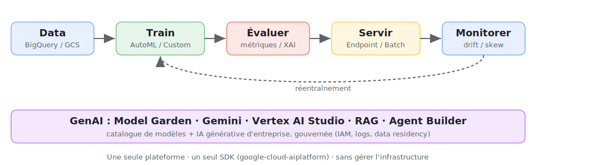
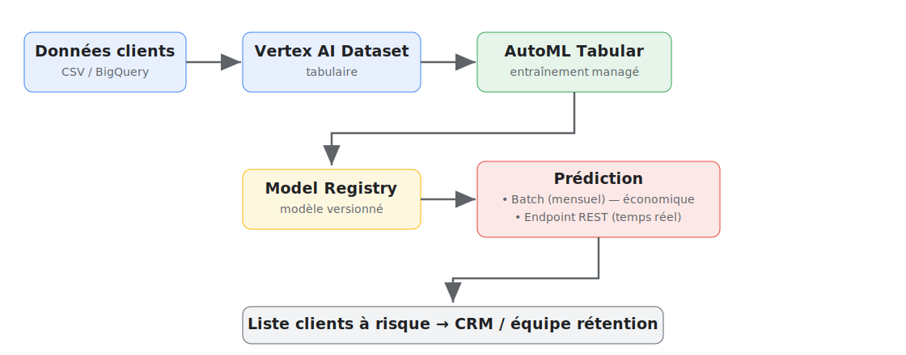

<!-- _class: lead -->
<!-- _paginate: false -->
<!-- _footer: "" -->

# Google **Vertex AI**
## Plateforme de Machine Learning managée

### Une évaluation critique pour une PME suisse data-driven

 

HEIG-VD — Infrastructures pour le stockage et le traitement de données
2025/26 · Présenté par Essinger Benoît & Rothen Evan · 12 juin 2026

<!--
Bonjour. Notre cheffe nous a demandé d'évaluer Vertex AI, la plateforme ML de Google Cloud.
On va répondre à 4 questions : qu'est-ce que c'est, qu'est-ce que ça nous apporte, combien ça coûte,
et faut-il l'adopter ? Avec une démo concrète : prédire quels clients vont nous quitter.
Présentation ~12 min, puis questions.
-->

---

## Le problème, côté PME

Nous sommes une **PME suisse** (≈ 50 000 clients) qui veut exploiter ses données :
prédire les départs clients, la demande, détecter la fraude...

**Mais :**
- pas d'équipe **MLOps** ni d'infra GPU à gérer ;
- les data scientists sont rares et chers ;
- on veut un **résultat en jours, pas en mois** ;
- le budget cloud doit rester **maîtrisé et prévisible**.

> Question : peut-on faire du ML *sérieux* sans construire toute la plomberie nous-mêmes ?

<!--
Plantons le décor business. On a des données mais pas l'armée d'ingénieurs ML de Google.
La promesse d'une plateforme managée, c'est exactement de combler ce trou. On va vérifier si elle tient.
-->

---

## Vertex AI en une phrase

> La **plateforme ML/IA unifiée** de Google Cloud qui couvre **tout le cycle de vie** d'un modèle,
> de la donnée jusqu'au monitoring en production — **sans gérer l'infrastructure**.

Un seul endroit pour : data → entraînement (AutoML / Custom) → évaluation → serving → monitoring, <strong>plus</strong> la GenAI d'entreprise (Model Garden, Gemini) depuis 2023.

<!--
Vertex AI est né en 2021 de la fusion d'AI Platform et d'AutoML. L'idée : une seule console, un seul SDK,
pour toute la chaîne. Important : ce n'est plus qu'une plateforme "ML classique", c'est aussi devenu
le point d'entrée GenAI de Google (Gemini, Model Garden). Si l'image ne charge pas hors-ligne, voir le schéma de l'annexe.
-->

---

## Les briques — lecture d'ingénieur (important ≠ gadget)

| Brique | Rôle | Pour une PME |
|---|---|:---:|
| **AutoML** (tabular, image, texte) | Modèle sans coder l'algo | ⭐⭐⭐ |
| **Prediction / Endpoints** | Servir : online (REST) ou batch | ⭐⭐⭐ |
| **Model Garden + Gemini** | Catalogue + API GenAI | ⭐⭐⭐ |
| **Custom Training** | Notre code (TF/PyTorch/sklearn) | ⭐⭐ |
| **Model Registry / Monitoring** | Versionner, détecter la dérive | ⭐⭐ |
| **Pipelines / Feature Store** | MLOps avancé | ⭐ (souvent overkill au début) |

On distingue ce qui crée de la valeur tout de suite (AutoML, serving, GenAI) de ce qui sert à maturité.

<!--
Le piège marketing : Google liste 20 services. En vrai, pour démarrer, 3 comptent : AutoML pour produire un modèle,
le serving pour l'utiliser, et la partie GenAI. Feature Store et Pipelines sont puissants mais souvent
surdimensionnés pour une PME qui débute. C'est le genre de tri que la cheffe attend de nous.
-->

---

## Comment ça s'intègre

**Entrées**
- CSV / Parquet sur **Cloud Storage**
- Tables **BigQuery**
- Images, texte, vidéo

**Interfaces**
- **SDK Python** `google-cloud-aiplatform`
- CLI **`gcloud`**, API REST/gRPC
- Console web, Terraform

**Sorties**
- **Endpoint REST** (prédiction temps réel)
- **Batch** → fichiers GCS / BigQuery
- Métriques d'évaluation
- Attributions **Explainable AI**

**Sécurité / gouvernance**
- IAM, VPC, data residency (UE/CH)
- Model Registry, audit logs

<!--
Point clé pour des data engineers : Vertex se branche naturellement sur BigQuery et Cloud Storage.
Si on est déjà sur GCP, l'intégration est quasi gratuite. Tout est scriptable en Python ou gcloud,
donc reproductible et versionnable.
-->

---

## Notre cas d'usage : prédiction de **churn**

**Scénario PME** : un service par abonnement perd des clients chaque mois.
Acquérir un client coûte 5–7× plus cher que de le retenir.

**Objectif** : à partir de l'historique client, **prédire qui risque de partir**
→ l'équipe rétention contacte les clients à risque **avant** qu'ils ne résilient.

**Pourquoi AutoML Tabular ?**
- données **tabulaires** (un CSV de clients) → cas idéal pour AutoML ;
- **pas besoin de coder un modèle** : on décrit la colonne cible, Vertex fait le reste ;
- livre un modèle + **importance des features** exploitable par le métier.

<!--
On a choisi le churn parce que c'est universel pour une PME par abonnement, le ROI est clair,
et les données sont tabulaires donc parfaites pour montrer AutoML. C'est aussi un cas où on verra
les forces ET les faiblesses : rapidité d'un côté, coût du serving et boîte noire de l'autre.
-->

---

## Architecture du cas d'usage

<!--
Le flux : nos données clients, on crée un dataset Vertex, on lance AutoML, le modèle va au registry,
puis on prédit. Choix important sur lequel on reviendra : batch mensuel (pas cher) vs endpoint temps réel (cher).
La sortie alimente directement le CRM.
-->

---

<!-- _class: demo -->
<!-- _paginate: true -->

# 🎬 Démo

## De zéro à un modèle de churn déployé

1. Charger le CSV clients → **Dataset** Vertex AI
2. Lancer un entraînement **AutoML Tabular** (cible = `churned`)
3. Lire l'**évaluation** + l'**importance des features**
4. **Prédiction batch** sur les clients actuels → liste à risque

SDK Python `google-cloud-aiplatform` · projet sur crédit gratuit Google Cloud (300 $)

<!--
On bascule sur la démo (notebook). Si le live échoue, on a des captures. Insister : on n'a écrit AUCUN
code de modèle ML — juste de la configuration. C'est ça la promesse d'AutoML. Montrer l'entraînement
(déjà lancé avant, car ça prend ~1-2h), l'évaluation, et la prédiction batch.
-->

---

## Bénéfices observés

- Time-to-model : d'un CSV à un modèle déployable **sans écrire de modèle**.
- Zéro infra : pas de serveurs, pas de GPU, scaling automatique.
- Unifié : data (BigQuery) → train → serve → monitor → GenAI, **un seul SDK**.
- Explicabilité : importance des features directement exploitable par le métier.
- Qualité : AutoML rivalise souvent avec un modèle « maison » non optimisé.
- GenAI gouvernée : Gemini + Model Garden avec IAM, logs, data residency.

<!--
Côté positif, et c'est réel : la vitesse. En une demi-journée on a un modèle correct sans expertise pointue.
Pour une PME sans data scientist senior, c'est le vrai argument. L'explicabilité parle aussi au métier.
-->

---

## Limites & risques (sans filtre marketing)

- Coût peu prévisible : endpoints *always-on*, node-heures, tokens → factures qui dérapent.
- Boîte noire : AutoML = peu de contrôle sur l'algo (Explainable AI atténue, sans plus).
- Vendor lock-in (slide suivante).
- Complexité à maturité : Pipelines / Feature Store ont une vraie courbe d'apprentissage.
- Produits mouvants : renommages fréquents, tutoriels vite périmés.
- Overkill possible : pour un besoin simple et stable, `scikit-learn` + un cron coûtent ~0.

<!--
La cheffe nous a demandé d'être critiques. Le principal danger n'est pas technique mais financier :
un endpoint oublié facture 24/7 même sans trafic. Et AutoML reste une boîte noire : acceptable pour du churn,
problématique si on doit justifier chaque décision (crédit, santé). On y revient dans les recommandations.
-->

---

## Coûts — structure & scénario chiffré

**Modèle** : pas d'abonnement, **paiement à l'usage** (compute + stockage), facturé à la seconde.
- Entraînement AutoML Tabular : **≈ 21 $/node-heure**
- Endpoint online `n1-standard-4` : **≈ 0,22 $/h → ~160 $/mois en 24/7** (facturé même sans trafic !)
- Batch : seulement le compute du job · Gemini : au token

| Poste (churn, scoring **mensuel**) | Endpoint 24/7 | **Batch mensuel** |
|---|---:|---:|
| Entraînement (~2 node-h/mois) | 42 $ | 42 $ |
| Serving | **160 $** | **8 $** |
| Stockage + notebook dev | 15 $ | 15 $ |
| **Total / mois** | **≈ 217 $ (~CHF 195)** | **≈ 65 $ (~CHF 60)** |

> 💡 **Levier n°1** : sans besoin de temps réel, le **batch divise la facture par ~3**.

<!--
Chiffres réels 2026. Le tableau est le cœur du message coût : le même cas d'usage coûte 195 ou 60 francs
selon UN choix d'architecture. Beaucoup d'équipes laissent un endpoint tourner par défaut. Pour du churn
scoré une fois par mois, c'est de l'argent jeté. Sur un an : ~2300 vs ~700 CHF.
-->

---

## Vendor lock-in

| Niveau | Éléments | Mitigation |
|:---:|---|---|
| 🔴 Fort | AutoML, Feature Store, Pipelines, API Gemini | Abstraire derrière une couche maison |
| 🟠 Moyen | Endpoints, SDK `aiplatform`, format datasets | Encapsuler les appels |
| 🟢 Faible | Custom training (notre conteneur), données GCS/BigQuery, modèles OSS du Model Garden | Garder données en **formats ouverts** (Parquet/SQL) |

**Stratégie** : données + features en formats ouverts ; **custom training portable** si la portabilité
est critique ; éviter les services les plus propriétaires pour le **cœur métier**.

<!--
Le lock-in n'est pas binaire. Nos données restent les nôtres et sont exportables : ça, c'est rassurant.
Le vrai piège, c'est le modèle AutoML qu'on ne peut pas vraiment réutiliser ailleurs. Recommandation :
si un composant devient stratégique, le construire en custom training pour rester portable.
-->

---

## Alternatives & positionnement

| Solution | À retenir |
|---|---|
| **AWS SageMaker** | Équivalent direct, écosystème AWS, plus riche mais plus complexe |
| **Azure ML** | Équivalent, fort en intégration entreprise Microsoft |
| **Databricks (MLflow)** | Lakehouse multi-cloud, moins « no-code » |
| **Open source** (scikit-learn, MLflow, FastAPI, Airflow) | Coût infra mini, contrôle total, mais tout à maintenir |
| **APIs GenAI** (OpenAI, Anthropic, HF) | Pour la GenAI pure, sans plateforme MLOps |

> Le bon choix dépend surtout de **où sont déjà nos données** et de notre **maturité MLOps**.

<!--
Vertex n'est pas magique : SageMaker et Azure ML font la même chose. Le critère décisif n'est pas technique
mais : sur quel cloud sont nos données ? Comme on est sur BigQuery dans le scénario, Vertex est le choix
naturel. Si on partait de zéro avec un petit besoin, l'open source serait plus économique.
-->

---

## Recommandations

### ✅ Adopter quand
- déjà sur **GCP / BigQuery**
- peu ou pas d'équipe **MLOps**
- besoin d'aller **vite**
- données tabulaires / images standard
- besoin **GenAI** gouverné
- charge **variable**

### ⛔ Éviter quand
- besoin **simple et stable** (scikit + cron)
- **petit budget** + trafic faible
- exigence forte de **portabilité / souveraineté**
- besoin de **contrôle fin** sur l'algo
- **multi-cloud** imposé

**Pour notre PME** : ✅ pertinent — on est sur BigQuery, pas de MLOps, besoin de vitesse.
**Condition** : scorer en **batch**, **undeploy** les endpoints, poser des **budgets d'alerte**.

<!--
La réponse à la cheffe : oui, mais avec des garde-fous. On adopte pour le churn parce qu'on coche les bonnes
cases, à condition de discipliner les coûts. Si demain le besoin devient simple et figé, on réinternalise.
-->

---

## Conclusion & références

**Vertex AI** = raccourci puissant pour faire du ML sans équipe dédiée — à condition de
**maîtriser les coûts** (batch vs online) et d'**accepter un certain lock-in**.

**Références**
- cloud.google.com/vertex-ai
- cloud.google.com/vertex-ai/docs
- cloud.google.com/vertex-ai/pricing
- Tuto AutoML Tabular (docs)
- SDK Python `google-cloud-aiplatform`

**À retenir**
- 3 briques utiles : AutoML · Serving · Gemini
- Coût = compute + stockage, à l'usage
- Endpoint always-on = piège n°1
- Données restent exportables

<!--
Message final en une phrase : Vertex AI achète de la vitesse et de la simplicité, on la paie en coût récurrent
et en dépendance. Pour notre PME, le deal est bon si on reste discipliné. Merci, on prend vos questions.
-->

---

<!-- _class: lead -->
<!-- _paginate: false -->
<!-- _footer: "" -->

# Questions ?

### Merci de votre attention

Annexe disponible : détails de coûts, commandes SDK, et la cheat sheet (2 pages).
